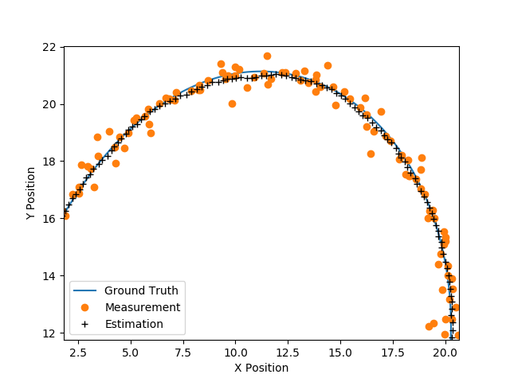

# udacity.carnd.unscented-kalman-filter
Udacity Self-Driving Car Nanodegree Term 2 Project 2: Unscented Kalman Filter

# Build Instructions
```
mkdir build && cd build
cmake .. && make
```

# Run Sample Input Files
```
build/UnscentedKF data/obj_pose-laser-radar-synthetic-input.txt build/output.txt
```

# Results

```
python utils/report.py build/output.txt
```

## Position Overlay



## Velocity Overlay


## Root Mean Square Error

|X-Position|Y-Position|X-Velocity|Y-Velocity|
|---|---|---|---|
|0.0800431|0.0982951|0.349081|0.242902|
